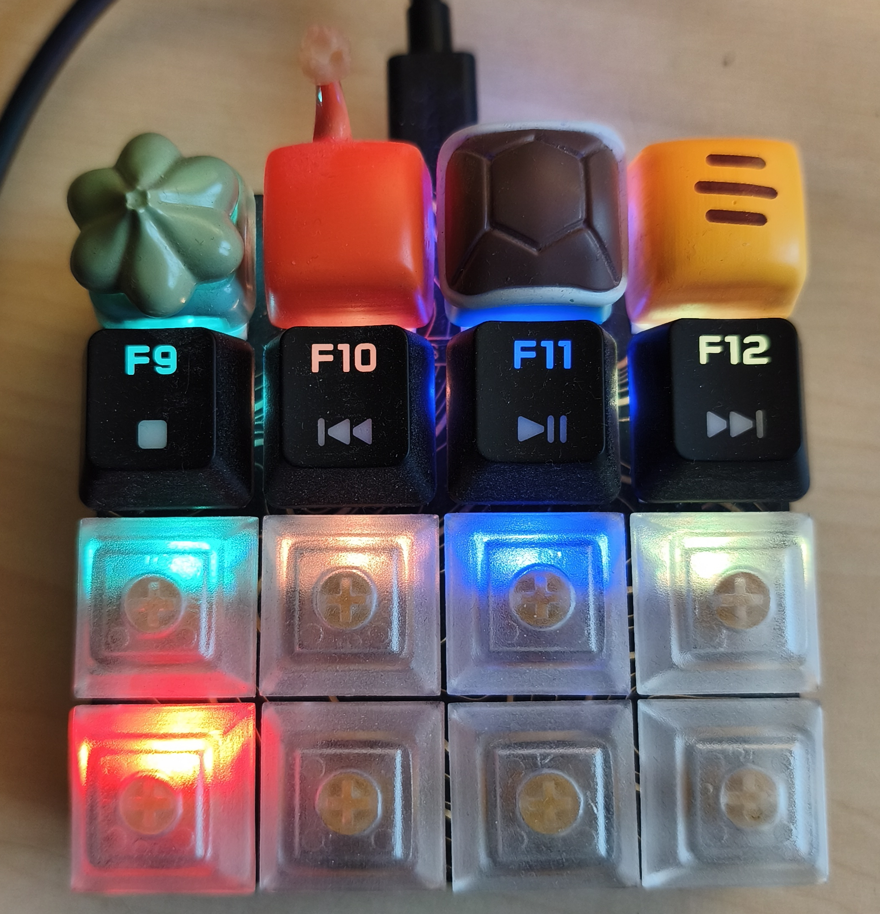

# Keybow 2040



Copy this repo’s [code.py](code.py) to the top level of **CIRCUITPY**, replacing the existing `code.py` if there is one. The code starts automatically.

## Terminal preview

On Linux or macOS, use Python 3 and a terminal with true-colour support. No extra packages or connected Keybow needed.

```sh
python3 preview.py
```

- **1–4**: grass, fire, water, or lightning.
- **Space**: return to the static colours.
- **q**, **Esc**, or **Ctrl+C**: quit.

The grid matches the keyboard with its USB port at the top. Numbers are key IDs.


Effects last three seconds. The preview uses the same lighting code as the Keybow; colours may look different on the LEDs.
